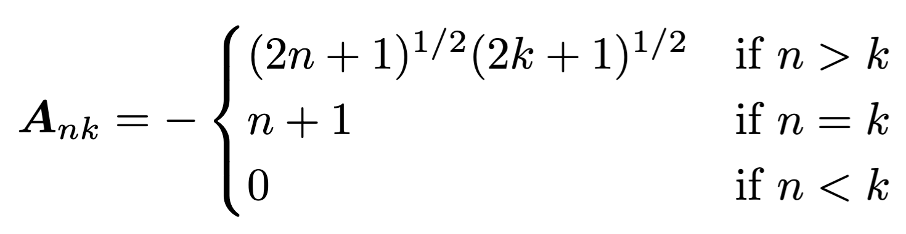
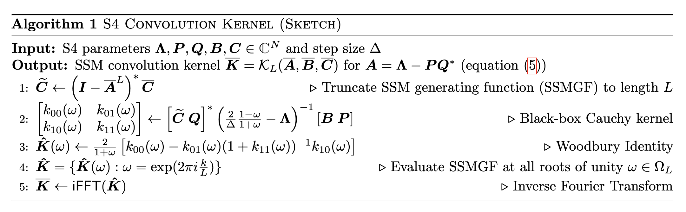

# Efficient Sequence Modelling with Structured State Spaces (S4)

## 🌟 Introduction
This project implements a simplified version of the **Structured State-Space Model (S4)** introduced by Gu et al. (2022). The S4 model is designed to efficiently handle long-range dependencies in sequences by leveraging signal processing tools, state space theory, and fast convolution via the Fourier domain. Unlike RNNs and Transformers, S4 achieves linear time complexity in sequence length while still capturing complex, long-range dependencies.

S4 is part of a growing class of models that aim to overcome the limitations of attention-based architectures by revisiting classical system dynamics. It uses specially structured matrices (HiPPO operators, diagonal plus low-rank components) to maintain and evolve hidden states over time. These ideas are drawn from control theory and combine strong theoretical foundations with practical efficiency.

In our project, we study how S4 performs on synthetic tasks like:
- **Memory task:** remembering and reproducing a value from earlier in the sequence.
- **Previous-bit task:** predicting a specific bit from a prior time step.

We implemented the core model components, designed task generators, and evaluated how well S4 models long-term dependencies in toy data.

## ⚙️ Implementation and Algorithm

### 📚 Theoretical Background: State Space Models and S4

Structured State Space Models (SSM) describe the dynamics of a hidden state evolving in time and producing an output. The general form of a continuous-time SSM is:

$$
x'(t)=\mathbf{A}x(t)+\mathbf{B}u(t)
$$
$$
y(t)=\mathbf{C}x(t)+\mathbf{D}u(t)
$$

where:
- $x(t) \in \mathbb{C}^n$: the $n$ state variables 
- $u(t) \in \mathbb{C}^m$: the $m$ state inputs,  
- $y(t) \in \mathbb{C}^p$: the $p$ outputs.

and four learnable matrices, **A**, **B**, **C**, and **D**:

- $\mathbf{A} \in \mathbb{C}^{n \times n}$: the state matrix (controlling the latent state $\mathbf{x}$) 
- $\mathbf{B} \in \mathbb{C}^{n \times m}$: the control matrix 
- $\mathbf{C} \in \mathbb{C}^{p \times n}$: the output matrix 
- $\mathbf{D} \in \mathbb{C}^{p \times m}$: the command matrix

State Space Models can capture long-range dependencies by appropriately parameterizing the transisiton matrix $A$. In S4 (Structured State Space Sequence model), the authors use a specific type of matrix called a **HiPPO matrix** to achieve this goal.

The HiPPO matrix defines a memory-preserving operator that emphasizes recent inputs while still retaining information from the distant past: 

<div align="center">
  
</div>


S4 introduces a new way to compute the model's input efficiently by converting the state evolution into a convolution:

$$
y(t)=(\mathbf{K}\ast u)(t)
$$

Here, the convolution kernel $\mathbf{K}$ is computed using FFT-based techniques and a **DPLR (Diagonal Plus Low Rank)** representation of $\mathbf{A}$, which enables fast computation in the frequency domain. The full kernel computation is outlined in the paper's **Algorithm 1**:

<div align="center">
  
</div>

This allows S4 to combine the benefits of continuous time modelling (interpretable memory dynamics), long-range dependency handling (via HiPPO), and fast discrete convolution (via FFT and DPLR). **Figure 1** from the original paper also illustrates this three-part design philosophy:

<div align="center">
  
</div>

### 📁 Code Structure

Our implementation follows the structure of Gu et al.'s reference and separates utility logic from model logic.
- `hippo.py`: Generates the HiPPO matrix used for memory-preserving dynamics.
- `helpers.py`: Contains functions for FFT-based kernel computation and DPLR manipulation.
- `model.py`: Defines the core S4 layer/module using the DPLR parameterization and convolution kernel computation.
- `generator_prevbit.py`/`generator_memory.py`: Defines the toy sequence tasks (bit prediction, memory recall).
- `Training/` and `SSM/` folders: Contain separate modules for training and module logic.

Our implementation mirrors the main steps of Algorithm 1:
1. Construct $\mathbf{A}=\Lambda-PQ^*$
2. Compute the Cauchy kernel using FFT
3. Apply the Woodbury identity
4. Evaluate $\hat{K}(\omega)$
5. Apply inverse FFT to get kernel $K$
6. Convolve $K$ with input sequence $u(t)$


## 📦 Package Installation and Examples

> ⚠️ *Note: Implementation and training are still in progress.*

This section will be updated once model testing and training are finalized. In the final version, we plan to include:
- `requirements.txt` for easy dependency installation
- Example usage instructions for training and evaluation
- A Jupyter notebook (`demos.ipynb`) demonstrating:
  - Memory task performance
  - Kernel visualization
  - Model predictions on test sequences

### 🔧 Installation

To install required packages, run:

```bash
pip install -r requirements.txt
```

Make sure your project folder contains the following structure:

```text
├── SSM/
│   ├── helpers.py
│   ├── hippo.py
│   └── model.py
├── Training/
│   ├── generator_memory.py
│   └── generator_prevbit.py
├── demos.ipynb
├── requirements.txt
```

### 🚀 Running the model

To train the model on one of the tasks (PrevBit and Memory Copy), open:

```bash
demos.ipynb
```

Inside the notebook:
- **PrevBit Task**: Trains the SSM in a binary sequence prediction task where the target is the previous bit.
- **Memory Copy Task**: Trains the SSM to remember and recall a short sequence after a delay.
- Includes visualizations of:
  - Training loss over epochs
  - Sequence predictions compared to actual output

You can run each cell step-by-step and modify hyperparameters such as sequence length, delay, and state dimension as needed.


## 🔍 Reflection and Future Work
We found this project both challenging and rewarding. At first, understanding the HiPPO framework and DPLR decomposition was conceptually difficult, but working through the code clarified how the theory translates into efficient computation. Writing our own kernel generation and FFT routines helped reinforce our understanding of spectral filtering.

Challenges included:
- Ensuring numerical stability in kernel generation
- Debugging FFT-based convolutions and shape mismatches
- Interpreting synthetic task formats and outputs

Future improvements we'd like to explore:
- Run longer and more stable training runs
- Compare against a simple RNN baseline
- Evaluate performance on real-world data (e.g. ECG, language)
- Visualize intermediate activations and kernel responses

### 📝 References
[1] Gu, Albert et al. "Efficiently Modeling Long Sequences with Structured State Spaces." *ICLR 2022*. https://arxiv.org/abs/2111.00396

[2] Gu, Albert et al. "HiPPO: Recurrent Memory with Optimal Polynomial Projections." *INSERT SOURCE PUBLISHER HERE*. https://arxiv.org/abs/2008.07669 

[3] Bourdois, Romain. "Introduction to State Space Models (S4)." *Medium.com, 2024*. https://huggingface.co/blog/lbourdois/get-on-the-ssm-train


### Other

<a href="https://utexas-my.sharepoint.com/:p:/g/personal/lmn934_eid_utexas_edu/IQDJ-YXRZJ_SRqS7gk6mMg8jAQNq4ZPrrhigrs_unsX8Ilo?e=xpG8uw" target="_blank">Presentation</a>


