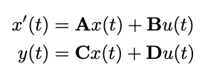

# Efficient Sequence Modelling with Structured State Spaces (S4)

## 🌟 Introduction
This project implements a simplified version of the **Structured State-Space Model (S4)** introduced by Gu et al. (2022). The S4 model is designed to efficiently handle long-range dependencies in sequences by leveraging signal processing tools, state space theory, and fast convolution via the Fourier domain. Unlike RNNs and Transformers, S4 achieves linear time complexity in sequence length while still capturing complex, long-range dependencies.

S4 is part of a growing class of models that aim to overcome the limitations of attention-based architectures by revisiting classical system dynamics. It uses specially structured matrices (HiPPO operators, diagonal plus low-rank components) to maintain and evolve hidden states over time. These ideas are drawn from control theory and combine strong theoretical foundations with practical efficiency.

In our project, we study how S4 performs on synthetic tasks like:
- **Memory task:** remembering and reproducing a value from earlier in the sequence.
- **Previous-bit task:** predicting a specific bit from a prior time step.

We implemented the core model components, designed task generators, and evaluated how well S4 models long-term dependencies in toy data.

## ⚙️ Implementation and Algorithm

### 📚 Theoretical Background: State Space Models and S4

Structured State Space Models (SSM) describe how a latent state evolves over time in response to inputs and produces outputs..
The general form of a continuous-time linear-time-invariant (LTI) SSM is:

<div align="center">
  
</div>

where:
- $x(t) \in \mathbb{C}^n$: the $n$ state variables 
- $u(t) \in \mathbb{C}^m$: the $m$ state inputs,  
- $y(t) \in \mathbb{C}^p$: the $p$ outputs.

and includes four learnable matrices, **A**, **B**, **C**, and **D**:

- $\mathbf{A} \in \mathbb{C}^{n \times n}$: the state matrix (controlling the latent state $\mathbf{x}$) 
- $\mathbf{B} \in \mathbb{C}^{n \times m}$: the control matrix 
- $\mathbf{C} \in \mathbb{C}^{p \times n}$: the output matrix 
- $\mathbf{D} \in \mathbb{C}^{p \times m}$: the command matrix

These systems can model long-range dependencies in sequential data, especially when $\mathbf{A}$ is structured properly.

In the S4 (Structured State Space Sequence) model proposed by Gu et al., the matrix $\mathbf{A}$ is parameterized using
a **HiPPO matrix**, which is designed to preserve memory of past inputs with exponentially decaying weights:

<div align="center">
  
</div>

The HiPPO (High-Order Polynomial Projection Operator) framework projects the input function onto a polynomial
basis. A specific instance, **HiPPO LegS**, uses the Legendre Polynomial basis and results in a matrix with 
known continuous-time dynamics. These matrices are then discretized for implementation in modelling dynamic systems.

Rather than implementing the full S4 algorithm (which includes FFT-based convolution and a DPLR [Diagonal Plus Low Rank]
representation), our implementation focuses on a more simplified interpretation of SSMs using:
- Discretized HiPPO-LegS matrices
- Standard matrix recurrence: $x_{t+1}=\mathbf{A}x_t+\mathbf{B}u_t$
- Output prediction: $y_t=\mathbf{C}x_t$
- Training via backpropagation through time (BPTT)

<!-- This design allows us to study the memory and recurrence dynamics of S4-like models while keeping the codebase manageable and easy to understand.  -->

The S4 model combines continuous-time state space dynamics, HiPPO-based long-range memory, and fast discrete comvolution for efficient sequence modelling (Gu et al.).

<div align="center">
  
</div>

### 📁 Code Structure

Here is a summary of how each module contributes to the implementation:
- `hippo.py`:
  - Constructs the **HiPPO-LegS** matrix $\mathbf{A}$ in continuous time
  - Discretizes $\mathbf{A}$ using bilinear (Tustin) transform to give a learnable discrete-time state transition matrix
- `helpers.py`:
  - Defines utility functions:
    - `sigmoid()`: maps logits to probabilities
    - `binary_cross_entropy()`: used to compute classification loss
- `model.py`:
  - Defines the class `SimpleSSM`, our main model
  - Implements the recurrence $x_{t+1}=\mathbf{A}x_{t}+\mathbf{B}u_t$, $y_t=\mathbf{C}x_t$
  - Includes:
    - `forward()`: computes outputs over time
    - `loss_and_grads()`: computes binary-cross-entropy and gradients via BPTT
    - `loss_and_grads_mse()`: an alternate loss function (MSE)
    - `step()`: applies gradient descent with optional clipping
- `generator_prevbit.py`/`generator_memory.py`
  - Defines toy tasks for evaluating sequence learning (bit prediction, memory recall)
- `Training/`:
  - Houses all data and training logic
- `SSM/`:
  - Houses all modules for model logic


### Summary of Algorithm

Our training loop operates as follows:
1. Generate input/target sequence (e.g., binary memory task)
2. Run forward pass
  - Update state: $x_{t+1}=\mathbf{A}x_{t}+\mathbf{B}u_t$
  - Predict output: $y_t=\mathbf{C}x_t$
3. Compute loss
  - Use binary-cross entropy (or MSE)
4. Backpropagation Through Time (BPTT)
  - Accumulate gradients over the full sequence
5. Gradient descent update
  - Optionally apply clipping to prevent exploding gradients
  - Update parameters $\mathbf{A}, \mathbf{B}, \mathbf{C}$

<!-- <div align="center">
  
</div> -->

## 📦 Package Installation and Examples

> ⚠️ *Note: Implementation and training are still in progress.*

This section will be updated once model testing and training are finalized. In the final version, we plan to include:
- `requirements.txt` for easy dependency installation
- Example usage instructions for training and evaluation
- A Jupyter notebook (`demos.ipynb`) demonstrating:
  - Memory task performance
  - Kernel visualization
  - Model predictions on test sequences

### 🔧 Installation

To install required packages, run:

```bash
pip install -r requirements.txt
```

Make sure your project folder contains the following structure:

```text
├── SSM/
│   ├── helpers.py
│   ├── hippo.py
│   └── model.py
├── Training/
│   ├── generator_memory.py
│   └── generator_prevbit.py
├── demos.ipynb
├── requirements.txt
```

### 🚀 Running the model

To train the model on one of the tasks (PrevBit and Memory Copy), open:

```bash
demos.ipynb
```

Inside the notebook:
- **PrevBit Task**: Trains the SSM in a binary sequence prediction task where the target is the previous bit.
- **Memory Copy Task**: Trains the SSM to remember and recall a short sequence after a delay.
- Includes visualizations of:
  - Training loss over epochs
  - Sequence predictions compared to actual output

You can run each cell step-by-step and modify hyperparameters such as sequence length, delay, and state dimension as needed.


## 🔍 Reflection and Future Work
We found this project both challenging and rewarding. At first, understanding the HiPPO framework and DPLR decomposition was conceptually difficult, but working through the code clarified how the theory translates into efficient computation. Writing our own kernel generation and FFT routines helped reinforce our understanding of spectral filtering.

Challenges included:
- Ensuring numerical stability in kernel generation
- Debugging FFT-based convolutions and shape mismatches
- Interpreting synthetic task formats and outputs

Future improvements we'd like to explore:
- Run longer and more stable training runs
- Compare against a simple RNN baseline
- Evaluate performance on real-world data (e.g. ECG, language)
- Visualize intermediate activations and kernel responses

### 📝 References
[1] Gu, Albert et al. "Efficiently Modeling Long Sequences with Structured State Spaces." *ICLR 2022*. https://arxiv.org/abs/2111.00396

[2] Gu, Albert et al. "HiPPO: Recurrent Memory with Optimal Polynomial Projections." *INSERT SOURCE PUBLISHER HERE*. https://arxiv.org/abs/2008.07669 

[3] Bourdois, Romain. "Introduction to State Space Models (S4)." *Medium.com, 2024*. https://huggingface.co/blog/lbourdois/get-on-the-ssm-train


### Other

<a href="https://utexas-my.sharepoint.com/:p:/g/personal/lmn934_eid_utexas_edu/IQDJ-YXRZJ_SRqS7gk6mMg8jAQNq4ZPrrhigrs_unsX8Ilo?e=xpG8uw" target="_blank">Presentation</a>


