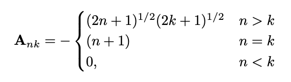
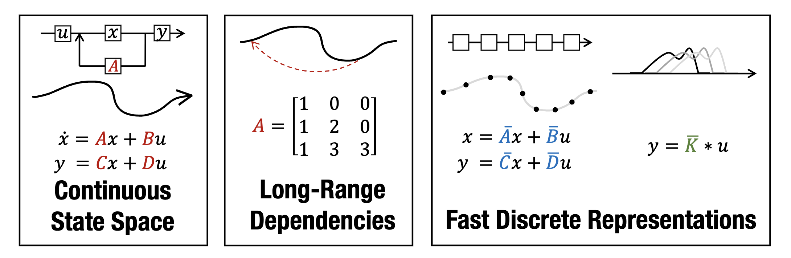

# Efficient Sequence Modelling with Structured State Spaces (S4)

## Introduction
This project implements a simplified version of the **Structured State-Space Model (S4)** introduced by Gu et al. (2022), which is designed for efficient and scalable sequence modelling. Unlike RNNs or Transformers, S4 handles **long-range dependencies** with linear time complexity by combining tools from signal processing, control theory, and fast Fourier transforms.

Fundamentally, S4 revisits classical continuous-time **state space models** and adapts them for deep learning. It uses structured matrices, such as **HiPPO operators** and **Diagonal Plus Low-Rank (DPLR)** representations, to evolve hidden states to emphasize recent inputs while preserving global context. These techniques allow S4 to model sequences efficiently with both rigorous design and practical scalability.

In this project, we explore a minimal HiPPO-based state space model inspired by S4. Rather than implementing the full S4 pipeline with FFT-based kernel generation and DPLR compression, we focus on a simpler architecture that uses discretized HiPPO matrices, linear state updates over time, and gradient-based training via backpropagation through time (BPTT).

We evaluate the model on two synthetic tasks:
- **Memory task:** recall a bit seen earlier in the sequence
- **Previous-bit task:** predict the bit immediately before the current one

These toy experiments help us understand the core principles behind S4 and evaluate how well a simplified version can capture long-range dependencies in idealized test scenarios.

## Implementation and Algorithm

### Theoretical Background: State Space Models and S4

Structured State Space Models (SSM) describe how a latent state evolves over time in response to inputs and produces outputs..
The general form of a continuous-time linear-time-invariant (LTI) SSM is:

<div align="center">
  
</div>

where:
- $x(t) \in \mathbb{C}^n$: the $n$ state variables 
- $u(t) \in \mathbb{C}^m$: the $m$ state inputs,  
- $y(t) \in \mathbb{C}^p$: the $p$ outputs.

and includes four learnable matrices, **A**, **B**, **C**, and **D**:

- $\mathbf{A} \in \mathbb{C}^{n \times n}$: the state matrix (controlling the latent state $\mathbf{x}$) 
- $\mathbf{B} \in \mathbb{C}^{n \times m}$: the control matrix 
- $\mathbf{C} \in \mathbb{C}^{p \times n}$: the output matrix 
- $\mathbf{D} \in \mathbb{C}^{p \times m}$: the command matrix

These systems can model long-range dependencies in sequential data, especially when $\mathbf{A}$ is structured properly.

In the S4 (Structured State Space Sequence) model proposed by Gu et al., the matrix $\mathbf{A}$ is parameterized using
a **HiPPO matrix**, which is designed to preserve memory of past inputs with exponentially decaying weights:

<div align="center">
  
</div>

The HiPPO (High-Order Polynomial Projection Operator) framework projects the input function onto a polynomial
basis. A specific instance, **HiPPO LegS**, uses the Legendre Polynomial basis and results in a matrix with 
known continuous-time dynamics. These matrices are then discretized for implementation in modelling dynamic systems.

Rather than implementing the full S4 algorithm (which includes FFT-based convolution and a DPLR [Diagonal Plus Low Rank]
representation), our implementation focuses on a more simplified interpretation of SSMs using:
- Discretized HiPPO-LegS matrices
- Standard matrix recurrence: $x_{t+1}=\mathbf{A}x_t+\mathbf{B}u_t$
- Output prediction: $y_t=\mathbf{C}x_t$
- Training via backpropagation through time (BPTT)

<!-- This design allows us to study the memory and recurrence dynamics of S4-like models while keeping the codebase manageable and easy to understand.  -->

The S4 model combines continuous-time state space dynamics, HiPPO-based long-range memory, and fast discrete convolution for efficient sequence modelling (Gu et al.).

<div align="center">
  
</div>

### Code Structure


- `SSM/`:
  - Houses all modules for model logic
  - `hippo.py`:
    - Constructs the **HiPPO-LegS** matrix $\mathbf{A}$ in continuous time
    - Discretizes $\mathbf{A}$ using bilinear (Tustin) transform to give a learnable discrete-time state transition matrix
  - `helpers.py`:
    - Defines utility functions:
      - `sigmoid()`: maps logits to probabilities
      - `binary_cross_entropy()`: used to compute classification loss
  - `model.py`:
    - Defines the class `SimpleSSM`, our main model
    - Implements the recurrence $x_{t+1}=\mathbf{A}x_{t}+\mathbf{B}u_t$, $y_t=\mathbf{C}x_t$
    - Includes:
      - `forward()`: computes outputs over time
      - `loss_and_grads()`: computes binary-cross-entropy and gradients via BPTT
      - `step()`: applies gradient descent with optional clipping
- `Training/`:
  - Houses all data and training logic
  - `generator_prevbit.py`
    - Defines toy tasks for evaluating sequence learning (bit prediction)
  - `generator_memory.py`
    - Defines toy tasks for evaluating sequence learning (memory recall)
- `Demos/`:
  - Houses our preliminary model implementations
- `Copymemory_Task.ipynb`
  - End to end model implementation (Data creation, model instantiation, training, testing) for memory recall task
- `Prebit_Task.ipynb`
  - End to end model implementation (Data creation, model instantiation, training, testing) for bit prediction task
- `hippo-experiments.ipynb`
  - Walk through of how the loss function decrease proceess varies when different elements of the hippo matrix are padded

Others:

- `assets/`
  - Readme images
- `Resources/`
  - Reference papers


### Summary of Algorithm

Our training loop operates as follows:
1. Generate input/target sequence (e.g., binary memory task)
2. Run forward pass
  - Update state: $x_{t+1}=\mathbf{A}x_{t}+\mathbf{B}u_t$
  - Predict output: $y_t=\mathbf{C}x_t$
3. Compute loss
  - Use binary-cross entropy
4. Backpropagation Through Time (BPTT)
  - Accumulate gradients over the full sequence
5. Gradient descent update
  - Optionally apply clipping to prevent exploding gradients
  - Update parameters $\mathbf{A}, \mathbf{B}, \mathbf{C}$

<!-- <div align="center">
  
</div> -->

## Package Installation and Examples

### Installation

To install required packages, run:

```bash
pip install -r requirements.txt
```

Make sure your project folder contains the following files:

```text
├── SSM/
│   ├── helpers.py
│   ├── hippo.py
│   ├── model.py
|   ├── mmodel.py
|   └── model_2.py

├── Training/
│   ├── generator_memory.py
│   └── generator_prevbit.py
├── Copymemory_Task.ipynb
├── Prevbit_Task.ipynb
├── hippo-experiments.ipynb
└── requirements.txt
```

### Running the model

To train the model on one of the tasks (PrevBit and Memory Copy), open:

```bash
Copymemory_Task.ipynb
Prevbit_Task.ipynb
```

- **PrevBit Task**: Trains the SSM in a binary sequence prediction task where the target is the previous bit.
- **Memory Copy Task**: Trains the SSM to remember and recall a short sequence after a delay.
- Includes visualizations of:
  - Training loss over epochs
  - Sequence predictions compared to actual output
- **hippo-experiments**: includes diagrams of how the loss function varied in the prevbit task, when different elements of hippo were padded

You can run each cell step-by-step and modify hyperparameters such as sequence length, delay, and state dimension as needed.


### Results

- **Previous-Bit Task:**
  - Accuracy stayed high even for long sequences. Logits and hidden states remained stable becuase the model only needs one-step memory.
- **Copy-Memory Task:**
  - As sequence length increased, logits and hidden states grew in magnitude. Recursive calling of the $A$ matrix during BPTT caused error accumulation and, which led to degraded performance.
- Previous-Bit requires minimal memory, whereas Copy-Memory requires long-range retention that our recursive-only implementation cannot support reliably.
- Using S4's convolution kernel (instead of pure recursion) would avoid repeatedly applying $A$ and may stabilize long-memory tasks.


## Reflection and Future Work

Challenges:
- Understanding how HiPPO and discretization affect stability
- Managing gradient growth when $A$ is applied repeatedly
- Debugging training behavior on long sequences
- Interpreting why hidden states and logits diverged in the Copy-Memory task

Future improvements:
- Implement the full S4 convolution kernel to avoid repeated multiplications by $A$
- Compare against baseline models (e.g., RNN, GRU) on the same tasks
- Test larger state dimensions and longer training to evaluate scaling behavior
- Apply the model to real sequential data (e.g., signals or physical systems)
- Visualize hidden state trajectories to better understand degradation patterns

### References
[1] Gu, Albert et al. "Efficiently Modeling Long Sequences with Structured State Spaces." *\2022*. https://arxiv.org/abs/2111.00396

[2] Gu, Albert et al. "HiPPO: Recurrent Memory with Optimal Polynomial Projections." *2020*. https://arxiv.org/abs/2008.07669 

[3] Bourdois, Loïck. "Introduction to State Space Models (S4)." *Medium.com, 2024*. https://huggingface.co/blog/lbourdois/get-on-the-ssm-train


### Other

<a href="https://utexas-my.sharepoint.com/:p:/g/personal/lmn934_eid_utexas_edu/IQDJ-YXRZJ_SRqS7gk6mMg8jAQNq4ZPrrhigrs_unsX8Ilo?e=xpG8uw" target="_blank">Presentation</a>


